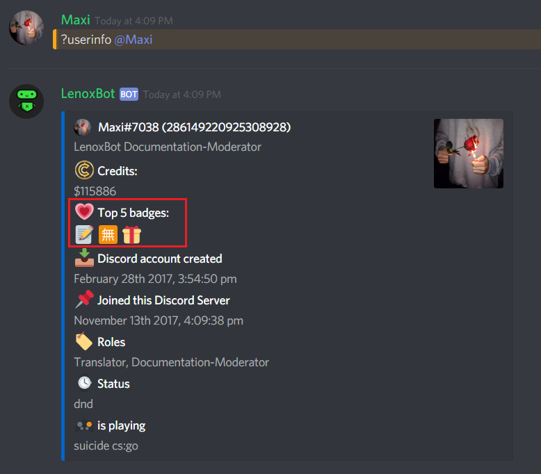
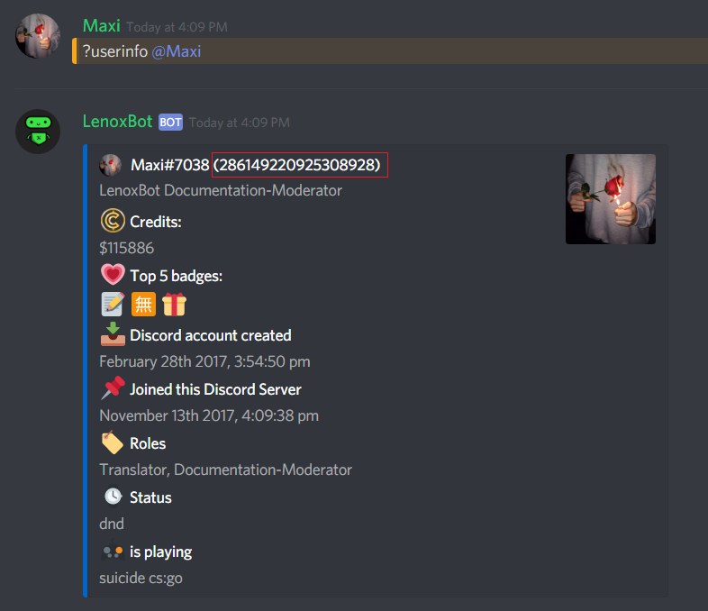

# Badges

## How I can see my badges?



The first way is the `?userinfo` command, this is the easiest way. You just type `?userinfo {@user/userID}` or `?ui {@user/userID}` to see the profile of an user, on the profile you can also see the badges, the problem with this command is: When a user have more than 5 badges you can just see 5 of them, so if a user have more than 5 badges use the second way.

Here we can see the "**Top 5**" badges of a user, if you want to know what emoji is standing for what badge scroll down.



* Go to [https://lenoxbot.com/](https://lenoxbot.com/)
* Click on your profile in the top of the right corner, now you see two possibilities: "Profile" "My servers"
* Click on "Profile", then you can see your profile and all of your badges, if you want to see the badges of another user type `?userinfo {@user/userID}` in the chat and copy the user-id.

* Copy the numbers behind the username.
* Then type in your browser "[https://lenoxbot.com/profile/](https://lenoxbot.com/profile/286149220925308928)**{the copied user-id}**" to open the profile of another user.



## Which badges exists?

Here is a list of all badges:

*  `🅰` **- Administator**
*  `⚒` **- Developer**
*  `👮` **- Moderator**
*  `👁` **- Documentation-Proofreader**
*  `📝` **- Documentation-Moderator**
*  `🗣` **- Translation-Leader**
*  `👁` **- Translation-Proofreader**
*  `❤` **- Donator**
*  `🈚` **- Translator**
*  `🎁` **- Birthday 2018**
*  `🅱` **- Bugreporter**
*  `🅿` **- Proposalwriter**

