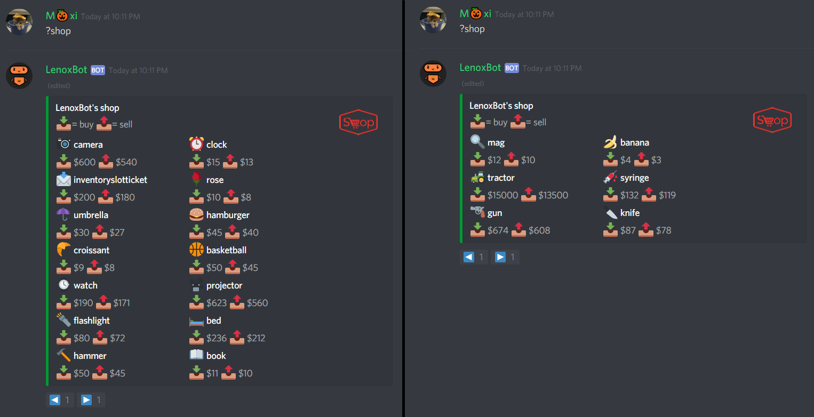
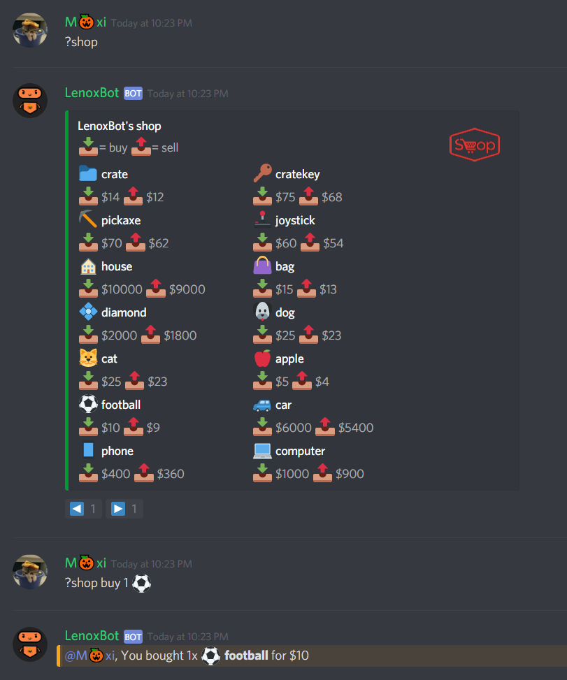
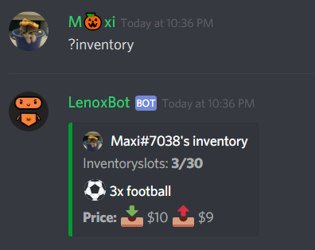
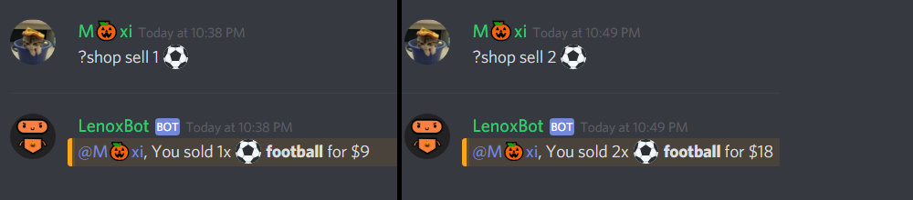

# Buy/Sell items

## Buy/Sell items

If you want to buy items follow the steps!

* Type `?shop` in the chat and decide the item and the amount you want to buy.

* If you want you can also react with `:arrow_forward:` \( ▶\) to see more items from the shop.

* If you decided an item type in  `´?shop buy {amount} {item}`, for example `?shop buy 1 :soccer:`, to buy the item\(s\).

If you want to sell items follow the next steps!

* Type `?inventory` to see all items you own and you can sell.

* After you've checked all your items type `?shop sell {amount} {item}` in the chat, for example `?shop sell 1 :soccer:`, to sell the item\(s\).


Buying or selling any LenoxBot-Item is totaly free, the only currency we use is the own currency from the LenoxBot, if you want to know how to earn credits check the following documentation entry:




