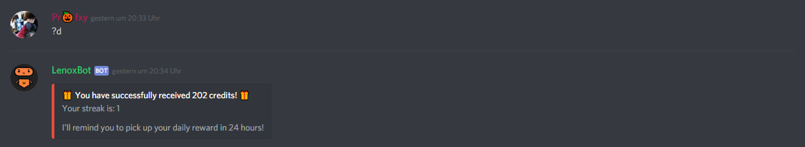
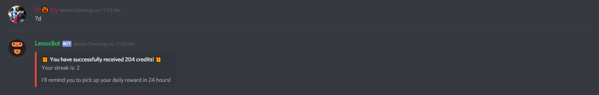

# Daily streak

The daily streak is a feature of the "_?daily"_ command_._ If you use that command the first time, you will have a streak of one.

But if you do this the next day \(in 24 hours\) you will have a streak of _two_ and will get **204 credits** and not ~~202 credits~~. It's like a bonus for active users.

For everyone who has a userkey gets the **double amount of credits**. You can get a userkey by [donating for LenoxBot](https://lenoxbot.com/donate).

