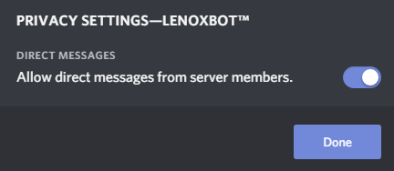

# Support

There is more than one possibility to receive support. Here is a list of all support sources:

* [Support Discord Server](support.md#support-discord-server)
* [Ticket on our support Discord Server](support.md#create-a-ticket-on-our-support-discord-server)
* [Documentation](support.md#read-through-our-documentation)

### Support Discord Server

We set up a discord server where you can discuss with users of our Bot and ask all your questions that you have. We offer support in all languages, which are also available for LenoxBot.

### Create a ticket on our Support Discord server

You can create a ticket on our Support Discord Server. Our Staff will receive the ticket and answer you as fast as possible! 

**How to create a ticket?**

1. Go on our Discord Server in your Discord server list \(Invite Link: [https://lenoxbot.com/discord](https://lenoxbot.com/discord)\)
2. Search for the **\#spam** or **\#testing** Discord channel
3. Enter the following: `?ticket {your text}`

If the ticket was successfull created, you will receive a confirmation with a link where you can see your ticket on our website. You will receive a direct message on discord if one of our staff members answered the ticket so please make sure that you activated the following setting for our Discord Server:

### Read through our Documentation

