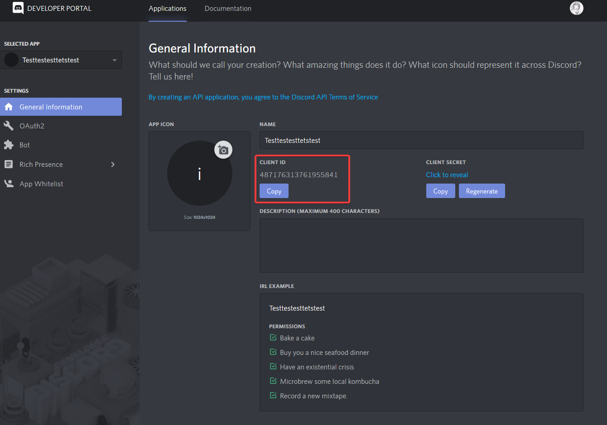

# Own instance of LenoxBot

Because we have an [open source project on GitHub,](https://github.com/lenoxbot/lenoxbot.git) you have the possibility to have your own instance of LenoxBot. We offer you a complete tutorial on how to install your own instance on Windows and Linux/Debian:



You must have already installed **NPM**, **Git**, **NodeJS** and **FFmpeg**! There are many tutorials online on how to install all these packages for your operating system.

1. Clone this repository \(Branch: **Master**\)
   * Execute `git clone https://github.com/LenoxBot/LenoxBot.git --branch master`
2. Now you have to execute a few commands in the folder in which you cloned LenoxBot:
   * `npm -g --add-python-to-path install windows-build-tools node-gyp`
   * `npm i --global --production windows-build-tools`
   * `npm i -S canvas@next`
   * `npm install`
3. Now you should have a folder called **`node_modules`**. In this folder are now all your installed packages.
4. Now you have to rename your **`settings_example.json`**, file located in the main folder to **`settings.json`**. Now enter your Discord Top Secret Token...
5. You can run the bot using the command `node lenoxbotapp.js`

To invite the bot on your Discord server, copy the Client ID of your bot application that you find [**here**](https://discordapp.com/developers/applications/) if you click on the application:

Now you can create an invite link for your bot [**here**](https://discordapi.com/permissions.html) for example.



You must have already installed **NPM**, **Git NodeJS** and **FFmpeg**! There are many tutorials online on how to install all these packages for your operating system.

1. Clone this repository \(Branch: **Master**\)
   * Execute `$ git clone https://github.com/LenoxBot/LenoxBot.git --branch master`
2. Now you have to execute a few commands in the folder in which you cloned LenoxBot:
   * `$ sudo apt-get install build-essential`
   * `$ sudo apt-get install libcairo2-dev libjpeg-dev libpango1.0-dev libgif-dev build-essential g++`
   * `$ npm i -S canvas@next`
   * `$ npm install`
3. Now you should have a folder called **`node_modules`**. In this folder are now all your installed packages.
4. Now you have to rename your **`settings_example.json`**, file located in the main folder to **`settings.json`**. Now enter your Discord Top Secret Token...
5. You can run the bot using the command `node lenoxbotapp.js`

To invite the bot on your Discord aerver, copy the Client ID of your bot application that you find [**here**](https://discordapp.com/developers/applications/) if you click on the application:

Now you can create an invite link for your bot [**here**](https://discordapi.com/permissions.html) for example.




If you need any help, you can join our [Discord Server](https://lenoxbot.com/discord)


