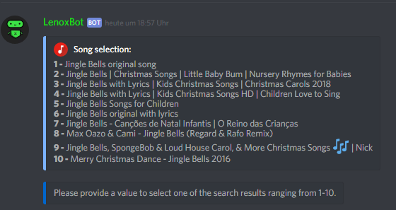
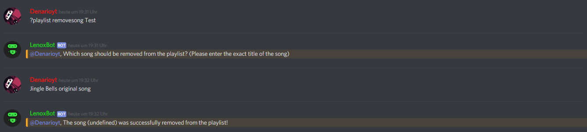

# Create a playlist

You wanted to add your own playlist but havn't got one at YouTube?  
Then you only need a [serverkey ](https://lenoxbot.com/donate)and can start!  
  
The first command is  `?playlist new <YourPlaylistName> to create a playlist.` Then you can add a song for example _jingle bells._ After you typed the song title there came many songs with this name. That's why you musst type a number of this song selection and then you added a song in your first playlist. Now you have the choice either you wanted to add more songs then you typed the next song title or you were finished and type `finish` 

If you typed finish but wanted to add more songs you have another way. With the  
`?playlist addsong <YourPlaylistName>` and the exact song title.  
  
**You added the wrong song?** 

Then you only type this command `?playlist remove <YourPlaylistName>` and the exact song title.

