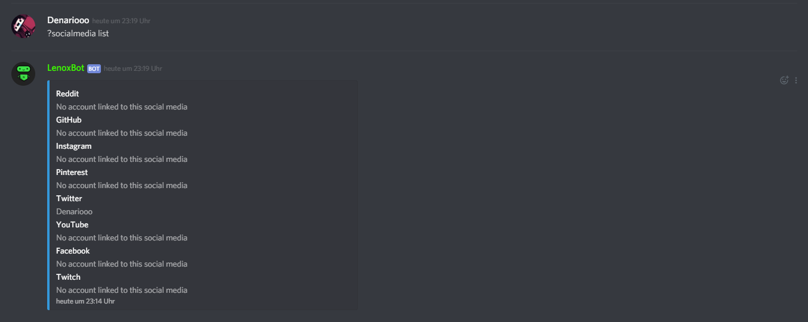

# Set socialmedia

So you can edit your socialmedia:

* Type **"?socialmedia edit** _**\[Reddit, GitHub, Instagram, Pinterest, Twitter, YouTube, Facebook, Twitch\] {Name}"**_
* Then you successfully  edit your socialmedia.

If you want to delete a socialmedia just type

* _?socialmedia delete_ \[_**youtube, twitch, instagram** or **twitter\]**_

If you want to see all your socialmedia just type

* ?_socialmedia list_

  
_****_

