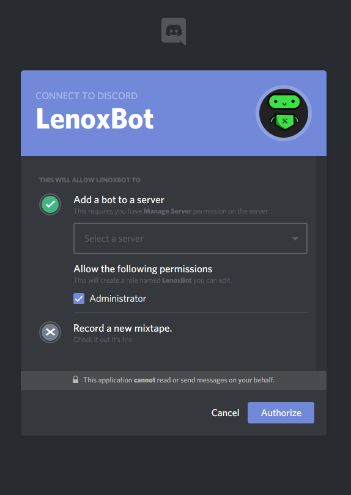
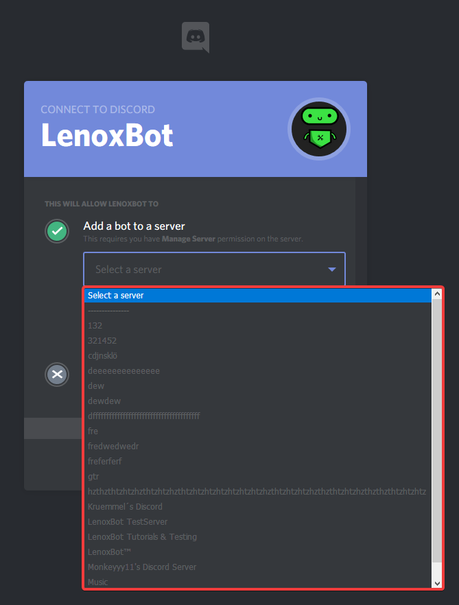

# Invite LenoxBot

Click on the [**Invite**](https://lenoxbot.com/invite/) button! \(If the link doesn't work, you can use this [**link**](https://discordapp.com/oauth2/authorize?client_id=354712333853130752&scope=bot&permissions=8)\)

If you click on the link, the opened website tab should look like this:

Now you have to select on which server you want to let join LenoxBot:

After you've selected your server, you have to authorize Discord to let join LenoxBot on your discord server!

If you don't know LenoxBot yet, you can read our Getting started:



