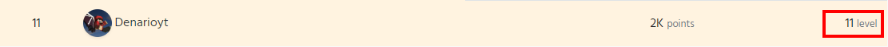

# Leaderboards

_Lenoxbot has got two kinds of leaderboards, the global leaderboard and the Server leaderboard._   
  
**Global leaderboard:**  
On the global leaderboard you can see the top 100 user with the most credits.   
You can also click on the names of each user to see that profil page.  
  
More informations you will get here:

  
**Server leaderboards:**  
On this leaderboard you can change under many discord server which used LenoxBot

If you'll click one server you can see many things:

* points
* levels
* username

### Points:

Points are like XP you'll get one point for writing one message. If you write five messages you'll also get five points.  
  
When your cursor touched the number of your points you will get the quite number. 

### Level:

