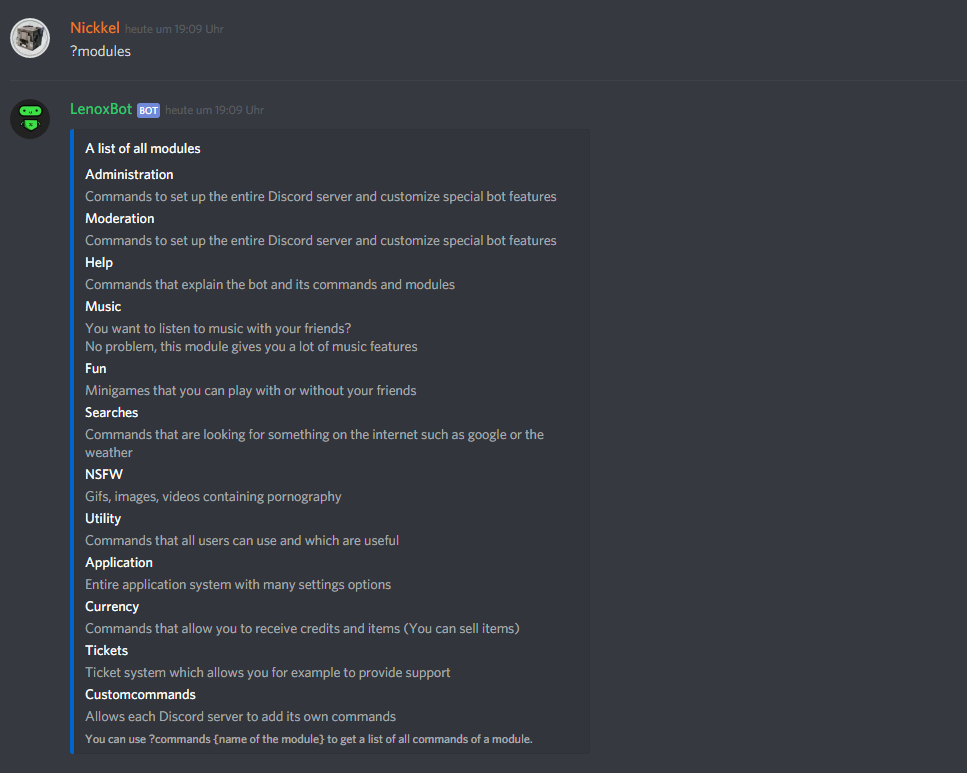

# Modules

Hey there, here we'd like to show you the ways, how to see our modules. There are two different ways to see all our modules.


Attention! We use our default prefix. Please note, that you can set your own prefix with `?prefix <prefix>`




First you can see it on our [**website**](https://lenoxbot.com/commands). There is an overview of each module on the left.




The second way is over the bot itself.

Just type `?modules`and you'll see all our modules.

* `?modules`




### **Your Reaction will be:**


_That's it. And now have fun with our commands._


